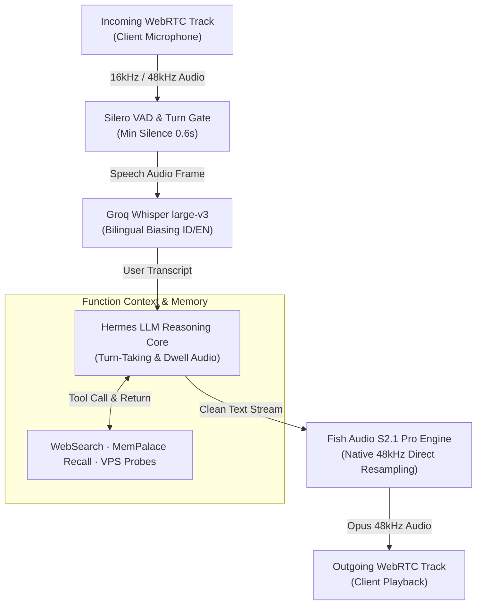

<div align="center">

# 🎙️ Shorekeeper Cascade Agent

**Enterprise-grade, modular cascade voice agent built with LiveKit Agents SDK, Groq Whisper large-v3, Hermes LLM tool reasoning, and Fish Audio S2.1 Pro TTS.**

[](https://github.com/Schnee111/shorekeeper-cascade-agent/releases)
[](https://github.com/Schnee111/shorekeeper-cascade-agent/actions)
[](https://github.com/Schnee111/shorekeeper-cascade-agent/pkgs/container/shorekeeper-cascade-agent)
[](LICENSE)
[](https://python.org)
[](https://livekit.io)

[Production HUD](https://jarvis.shorekeeper.my.id) • [Companion Web Client](https://github.com/Schnee111/shorekeeper-cascade-client) • [SemVer Guide](docs/SEMVER_CONVENTIONAL_COMMITS.md)

</div>

---

## 🌌 Why Shorekeeper Cascade Agent?

Monolithic Speech-to-Speech (S2S) models offer expressive vocal inflections, but lack granular control over tool execution, deterministic reasoning, and custom vocal timbre. 

**Shorekeeper Cascade Agent** decouples speech perception, tool deliberation, and vocal synthesis into a hardened, production-grade cascade:
- **Zero Phonetic Hallucination**: Groq-accelerated `whisper-large-v3` with Indonesian domain conversational prompt biasing and Silero VAD (`min_silence_duration = 0.6s`), eliminating erratic transcripts.
- **Natural Turn-Taking & Dwell Loops**: Early acknowledgment fillers triggered at `2.8s` latency threshold, followed by continuous periodic dwell loops every `4.0s` during long tool executions to maintain realistic human-like conversation.
- **True 48kHz Expressive Audio**: Native Fish Audio S2.1 Pro inference (`s2.1-pro-free`) strictly locked at `48,000 Hz` output to match native WebRTC Opus carrier frequencies and completely eliminate resampling crackle.
- **Resource-Constrained Production Architecture**: Runs inside a hardened multi-stage Docker container utilizing only **~172 MB RSS** of memory on a 3.6GB RAM VPS.

---

## 🌌 The Shorekeeper Ecosystem

The Shorekeeper voice intelligence project is architected across three independent, complementary open-source repositories:

| Repository | Paradigm | Technology Stack | Primary Role |
|---|---|---|---|
| **[shorekeeper-cascade-client](https://github.com/Schnee111/shorekeeper-cascade-client)** | **Web Client** | Svelte 5 (Runes) · Three.js · Vite · PWA | Production Web HUD, token streaming, 3D Spectro Particle Orb |
| **[shorekeeper-cascade-agent](https://github.com/Schnee111/shorekeeper-cascade-agent)** (This Repo) | **Cascade Pipeline** | LiveKit Python SDK · Groq Whisper · Hermes LLM · Fish Audio 48kHz | Modular STT-LLM-TTS voice pipeline, JWT token server |
| **[shorekeeper-s2s](https://github.com/Schnee111/shorekeeper-s2s)** | **Native S2S Monorepo** | Gemini 3.1 Live · WebRTC · OMP Worker Mesh · SQLite WAL | Flagship end-to-end speech-to-speech autonomous engineering platform |

---

## 🏛️ System Architecture



---

## 🛠️ Technology Stack

| Layer | Technologies & Frameworks | Description |
|---|---|---|
| **Speech-to-Text (STT)** | Groq Whisper `large-v3` · Deepgram Nova-3 | Sub-200ms transcription with Indonesian prompt biasing & dual fallback |
| **Vocal Activity Detection** | Silero VAD v4 · LiveKit Audio Input Filters | Turn detection, interruptibility guards, and noise gate |
| **Audio Enhancement** | ai-coustics `QUAIL_VF_S` | Neural audio restoration and microphone clarity enhancement |
| **LLM Reasoning Engine** | Hermes Agent Gateway · Custom Function Tools | Reasoning loop, memory tool dispatching, and dwell loop manager |
| **Text-to-Speech (TTS)** | Fish Audio S2.1 Pro (`s2.1-pro-free`) | Expressive neural speech synthesis strictly locked at native 48,000 Hz |
| **Transport & Protocol** | WebRTC · LiveKit Agents SDK 1.6.9 · aiohttp | Duplex low-latency audio carrier & ephemeral JWT issuer (:8082) |
| **DevOps & Runtime** | Python 3.11 · uv · Docker · GHCR · Systemd | Multi-stage slim containerization (~172MB RSS, 600M hard guard) |

---

## ⚡ Technical Benchmarks & Feature Comparison

| Benchmark / Metric | Shorekeeper Cascade Agent | Upstream Starter |
|---|---|---|
| **STT Accuracy (Indonesian)** | **High** (Whisper large-v3 + Context Prompting) | Low (Unbiased turbo models miss local idioms) |
| **TTS Audio Quality** | **48 kHz Native** (No aliasing noise) | 24 kHz default (Resampling distortion) |
| **Tool Stall Mitigation** | **Dynamic Dwell Fillers** (Continuous 4s loop) | Dead silence during tool execution |
| **Memory Footprint** | **~172 MiB RSS** (cgroups capped at 600M) | > 1.2 GiB (Unoptimized Python bases) |
| **Container Size** | **~260 MB** (multi-stage uv bookworm-slim) | ~1.4 GB standard image |
| **Auth & Token Server** | **Built-in JWT Issuer** (`127.0.0.1:8082`) | Separate or manual token generation |

---

## 🚀 Quickstart (Local Development)

### Prerequisites
- Python `>= 3.11, < 3.15`
- `uv` (Fastest Python package manager):
  ```bash
  curl -LsSf https://astral.sh/uv/install.sh | sh
  ```

### 1. Installation & Environment Setup
```bash
# Clone the repository
git clone https://github.com/Schnee111/shorekeeper-cascade-agent.git
cd shorekeeper-cascade-agent

# Install dependencies with frozen lockfile
uv sync --locked
```

Create a `.env.local` configuration file:
```bash
# LiveKit Cloud
LIVEKIT_URL=wss://your-project.livekit.cloud
LIVEKIT_API_KEY=your_key
LIVEKIT_API_SECRET=your_secret

# AI Providers
GROQ_API_KEY=gsk_...
DEEPGRAM_API_KEY=...
FISH_API_KEY=sk-fish...
```

### 2. Verify Code Quality & Test Suite
```bash
# Run Ruff linter & format verification
uv run ruff check .
uv run ruff format --check .

# Run Pytest suite
uv run pytest -v tests/
```

### 3. Start Agent & Token Server
```bash
# Terminal 1: Start LiveKit Voice Worker
uv run python src/agent.py dev

# Terminal 2: Start Ephemeral JWT Token Server
uv run python token_server.py
```

---

## 🐳 Production Deployment (Docker Compose)

The repository provides a production-hardened `docker-compose.prod.yml` ready for VPS environments:

```bash
# Pull and start services with CPU and memory limits
docker compose -f docker-compose.prod.yml up -d
```

### Container Resource Guardrails
```yaml
cascade-agent:
  image: ghcr.io/schnee111/shorekeeper-cascade-agent:latest
  deploy:
    resources:
      limits:
        cpus: '1.50'
        memory: 600M
  network_mode: host
  restart: unless-stopped
```

---

## 🔄 CI/CD & Automated Release

- **Continuous Integration**: Every PR and push to `main` runs `ruff` linting, code formatting checks, and `pytest` test suites via GitHub Actions (`.github/workflows/ci-cd.yml`).
- **Automated GHCR Deployment**: Pushes to `main` compile multi-stage images and push to GitHub Container Registry (`ghcr.io/schnee111/shorekeeper-cascade-agent`) tagged with short git SHAs (`sha-<hash>`) and semantic versions.
- **Automated SemVer**: Managed via **Google Release Please** (`.github/workflows/release-please.yml`). Adheres strictly to [Conventional Commits](docs/SEMVER_CONVENTIONAL_COMMITS.md).

---

## 📄 License

Distributed under the **MIT License**. See [LICENSE](LICENSE) for more information.

Developed with 🤍 by [Muhammad Daffa Ma'arif (Schnee111)](https://github.com/Schnee111).
